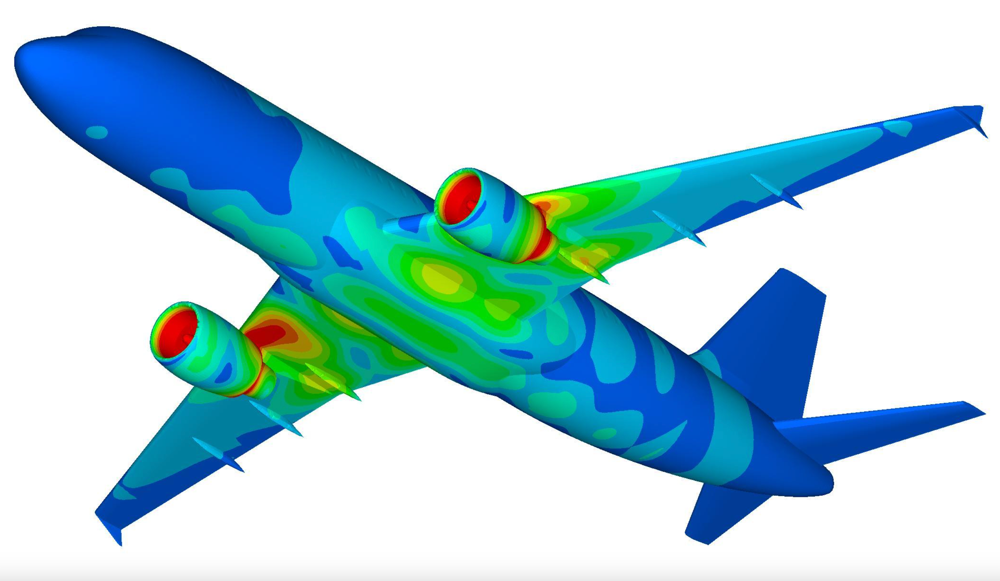
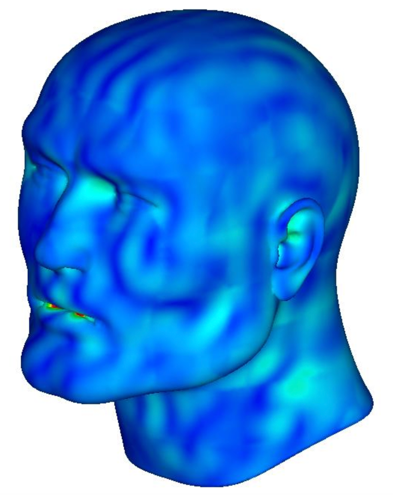
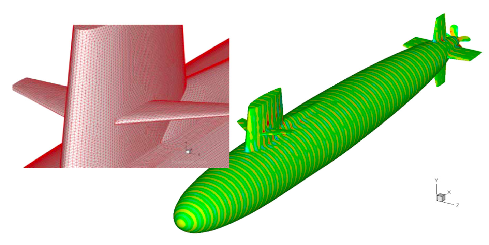
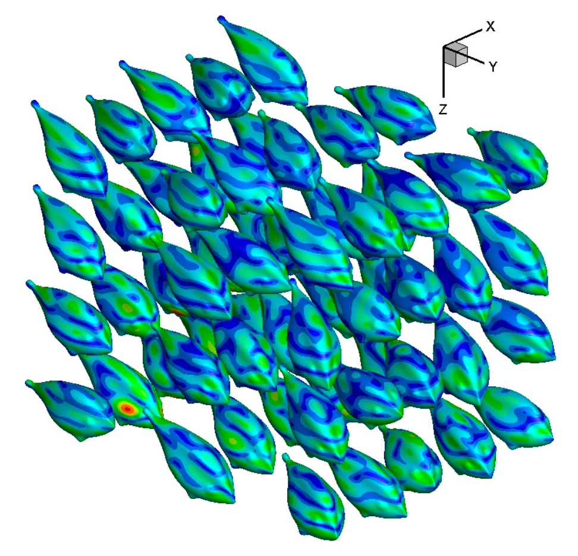

# BEM-paper-presentation  

Boundary Element Method paper for the course *Numerical Analysis for PDEs*, by Professor Antonietti, Polimi, a.y. 2023/2024  

Authors: Matteo Bonfadini (me), Manuel Alfano

## Abstract

The past fifty years have been marked by the evolution of computers and an enormous availability of computational power. This has boosted the development of computational methods and their application in engineering. The most popular computational method is the Finite Element Method (FEM), however around 1970 the engineering community started to develop the Boundary Element Method (BEM). This work considers the BEM theoretical formulation, and both its numerical approximation and parallel implementation based on the `pi-BEM` library.

| 1                                   | 2                                               |
| ----------------------------------- | ----------------------------------------------- |
|  |  |

| 3                                     | 4                                         |
| ------------------------------------- | ----------------------------------------- |
|  |  |

___

If you want to find out more about the BEM, you can check the paper [here](main.pdf) ↗️  
Instead, in the `presentation` folder you'll find the presentation slides.
